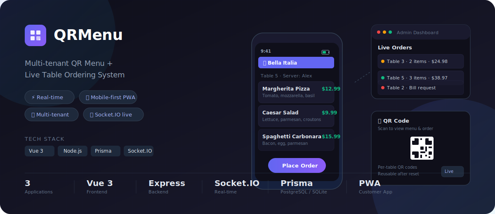

<p align="center">
  
</p>

<p align="center">
  <a href="https://github.com/alinme/qrmasterapp/blob/main/LICENSE"></a>
  <a href="#-features"></a>
  <a href="https://vuejs.org/"></a>
  <a href="https://www.prisma.io/"></a>
  <a href="https://socket.io/"></a>
  <a href="https://pnpm.io/"></a>
  <a href="https://tailwindcss.com/"></a>
</p>

---

**QRMenu** is a multi-tenant SaaS application that lets restaurants create digital QR menus with live table ordering. Customers scan a QR code at their table, browse the menu, place orders in real time — and the kitchen and waitstaff see them instantly.

## 📋 Table of Contents

- [✨ Features](#-features)
- [🏗 Architecture](#-architecture)
- [🚀 Quick Start](#-quick-start)
- [🔧 Environment Variables](#-environment-variables)
- [📁 Project Structure](#-project-structure)
- [📜 Available Scripts](#-available-scripts)
- [🌐 Production Deployment](#-production-deployment)
- [📄 License](#-license)

---

## ✨ Features

### Core Functionality

| Feature | Description |
|---------|-------------|
| ✅ **Multi-tenant** | Manage multiple restaurants from one platform |
| ✅ **QR Code Generation** | Per-table QR codes — reusable after reset |
| ✅ **Real-time Orders** | Socket.IO pushes orders to kitchen & staff instantly |
| ✅ **Live Orders Board** | Admin dashboard with real-time updates |
| ✅ **Kitchen Display** | Fullscreen mode for kitchen staff |
| ✅ **Table Sessions** | Track table occupancy and session state |
| ✅ **Order Status Tracking** | Pending → preparing → served lifecycle |
| ✅ **Server Management** | Role-based server assignment & order routing |
| ✅ **Bill & Payment** | Bill requests, custom tips, payment processing |
| ✅ **Customer Profiles** | Name, gender, avatar management |
| ✅ **Table Reset** | Automatic order filtering on table turnover |

### UI/UX

| Feature | Description |
|---------|-------------|
| ✅ **PWA Support** | Customer app works offline, installable on devices |
| ✅ **Dark Mode** | Full dark mode across all apps |
| ✅ **Icon Badges** | Status and information at a glance |
| ✅ **Collapsible Actions** | Clean server view with expandable buttons |
| ✅ **Tab-based Payments** | Organized payment & tip selection |
| ✅ **Custom Tip Drawer** | Bottom-sheet interface for custom amounts |
| ✅ **Persistent Tips** | Tip selection survives bill refreshes |
| ✅ **Visual Table Map** | Table layouts with chair positioning |

> See [CHANGELOG.md](./CHANGELOG.md) for detailed release history.

---

## 🏗 Architecture

```
┌─────────────┐     ┌──────────────┐     ┌─────────────┐
│  Customer    │     │   Admin      │     │   Server    │
│  App (Vue)   │────▶│  App (Vue)   │────▶│  (Express)  │
│  :5173       │     │  :5174       │     │  :3000      │
└─────────────┘     └──────────────┘     └──────┬──────┘
       │                     │                  │
       └─────────────────────┴──────────────────┘
                              │
                    ┌─────────▼─────────┐
                    │     Database       │
                    │  PostgreSQL/SQLite │
                    └───────────────────┘
```

The system has three components connected via REST + WebSocket:

- **Customer App** — Vue 3 PWA; customers scan QR codes to view menus and place orders
- **Admin Dashboard** — Vue 3 SPA; restaurant staff manage orders, tables, menu items
- **Server** — Express + Prisma + Socket.IO; business logic, persistence, real-time events

---

## 🚀 Quick Start

### Prerequisites

- **Node.js** ≥ 18
- **pnpm** — `npm install -g pnpm`

### 1. Install Dependencies

```bash
pnpm install
```

### 2. Configure Environment

Create `.env` files for each app (see [Environment Variables](#-environment-variables) below).

### 3. Set Up the Database

```bash
# Run migrations
pnpm db:migrate

# Seed demo data
pnpm db:seed
```

This creates a demo restaurant:

| Field | Value |
|-------|-------|
| **Email** | `admin@demo.com` |
| **Password** | `password` |
| **Restaurant Slug** | `demo` |

### 4. Start Development

```bash
# All apps in parallel
pnpm dev

# Or individually:
pnpm dev:server    # → http://localhost:3000
pnpm dev:customer  # → http://localhost:5173
pnpm dev:admin     # → http://localhost:5174
```

---

## 🔧 Environment Variables

### Server (`apps/server/.env`)

| Variable | Description | Default | Required |
|----------|-------------|---------|----------|
| `PORT` | Server port | `3000` | No |
| `DATABASE_URL` | Prisma connection string | `file:./prisma/dev.db` | Yes |
| `JWT_SECRET` | JWT signing key | `supersecret_dev_key` | Yes |
| `CUSTOMER_APP_URL` | Public customer app URL | `http://localhost:5173` | Yes |

### Customer App (`apps/customer/.env`)

| Variable | Description | Default | Required |
|----------|-------------|---------|----------|
| `VITE_API_URL` | Backend API URL | `http://localhost:3000/api` | No |
| `VITE_SOCKET_URL` | Socket.IO server URL | `http://localhost:3000` | No |

### Admin App (`apps/admin/.env`)

| Variable | Description | Default | Required |
|----------|-------------|---------|----------|
| `VITE_API_URL` | Backend API URL | `http://localhost:3000/api` | No |
| `VITE_SOCKET_URL` | Socket.IO server URL | `http://localhost:3000` | No |

> **`CUSTOMER_APP_URL` is critical** — it's embedded in QR codes that customers scan. Customers get redirected to:  
> `${CUSTOMER_APP_URL}/r/{restaurantSlug}/menu?t={token}`

---

## 📁 Project Structure

```
QRMenu/
├── apps/
│   ├── server/          # Node.js + Express + Prisma backend
│   │   ├── src/         # Routes, controllers, middleware
│   │   ├── prisma/      # Schema, migrations, seed
│   │   └── package.json
│   ├── customer/        # Vue 3 customer-facing PWA
│   │   ├── src/         # Components, views, stores
│   │   └── package.json
│   └── admin/           # Vue 3 admin dashboard
│       ├── src/         # Components, views, stores
│       └── package.json
├── packages/
│   └── shared/          # Shared TypeScript types & utilities
├── media/
│   └── hero.svg         # README hero graphic
├── package.json         # Root workspace config
└── pnpm-workspace.yaml  # pnpm workspace definition
```

---

## 📜 Available Scripts

| Command | Description |
|---------|-------------|
| `pnpm dev` | Start all apps in parallel |
| `pnpm dev:server` | Start server only |
| `pnpm dev:customer` | Start customer app only |
| `pnpm dev:admin` | Start admin app only |
| `pnpm build` | Build all apps for production |
| `pnpm db:migrate` | Run Prisma migrations |
| `pnpm db:seed` | Seed demo data |
| `pnpm db:studio` | Open Prisma Studio GUI |
| `pnpm db:generate` | Regenerate Prisma client |

---

## 🌐 Production Deployment

1. **Update environment variables** for your production URLs
2. **Change `JWT_SECRET`** to a cryptographically secure random string
3. **Switch to PostgreSQL** — update `DATABASE_URL` in `apps/server/.env`
4. **Build** — `pnpm build`
5. **Deploy each app** — server, customer, and admin independently

All three apps include `vercel.json` and `railway.toml` configuration for one-command deployment to [Vercel](https://vercel.com) or [Railway](https://railway.app).

---

## 📄 License

ISC — see [LICENSE](./LICENSE) for details.

---

<p align="center">
  <sub>Built with Vue 3, Express, Prisma, Socket.IO, and Tailwind CSS</sub>
</p>
